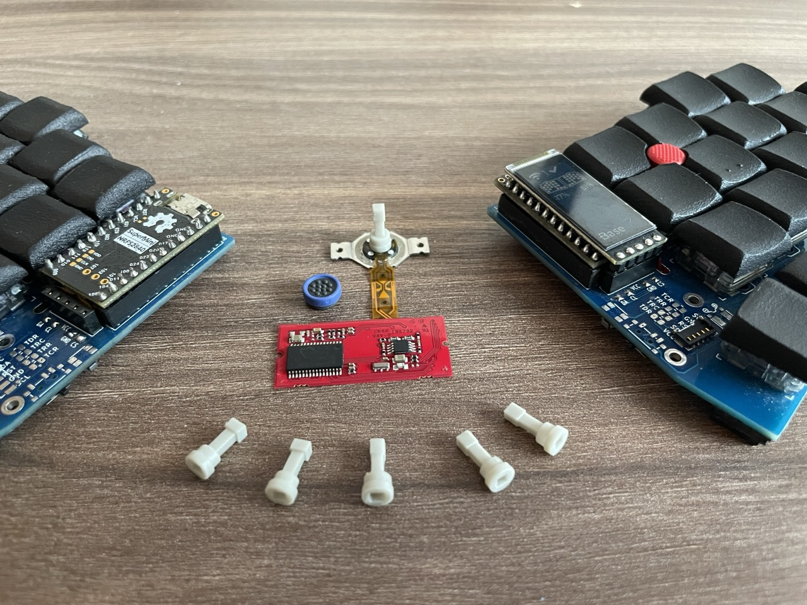
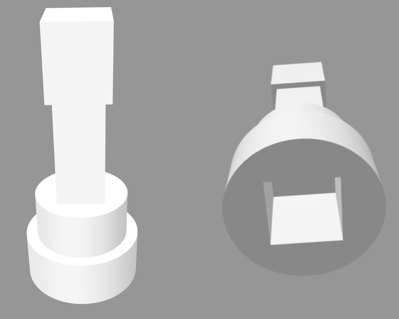
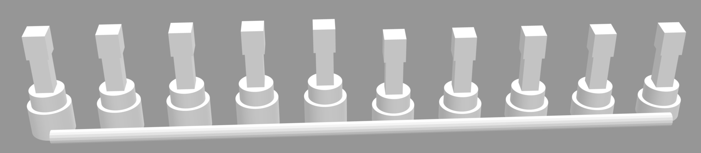

# TrackPoint Extensions

Python (build123d) scripts that generate TrackPoint extensions that can be used in DIY keyboards.

## Table Of Contents <!-- omit from toc -->

- [1. Photos](#1-photos)
- [2. Print Instructions](#2-print-instructions)
  - [2.1. Printing it yourself](#21-printing-it-yourself)
  - [2.2. Printing using JLC 3DP](#22-printing-using-jlc-3dp)
- [3. How to generate customized Extensions](#3-how-to-generate-customized-extensions)
  - [3.1. Install the generator script](#31-install-the-generator-script)
  - [3.2. Generate custom trackpoint extensions](#32-generate-custom-trackpoint-extensions)
- [4. How to add new TrackPoint models](#4-how-to-add-new-trackpoint-models)
  - [4.1. Set up the development environment](#41-set-up-the-development-environment)
  - [4.2. Add the new TrackPoint](#42-add-the-new-trackpoint)
- [5. Related Resources](#5-related-resources)
- [6. License](#6-license)

## 1. Photos





## 2. Print Instructions

> [!NOTE]
> I am a complete beginner with 3D printing. So, take my advice below with caution. If you have suggestions on how to do this better, please let me know.

### 2.1. Printing it yourself

In my experience, resin 3D printers do a much better job than FDM.

At first, I tried two local companies that offered 3D printing services using FDM printers. However, they were not accurate enough to make the extension hole fit the TrackPoints without cutting the hole bigger.

Next, I tried a company that used a resin printer with ABSLike material. This one was much more precise and the adapter hole fit well on the TP, but the material was too soft and cracked under pressure because the wall thickness at the corners was too small.

So, I increased the diameter of the adapter at the bottom of the extension and it worked much better. The current default for the diameter is 5mm, which means the wall thickness at the corners of the adapter hole is approximately 0.8mm.

I would prefer a thicker wall thickness, but my keyboard PCB's TrackPoint hole is only 5.5mm and I can't go bigger. So, if you design your own keyboard I recommend using a bigger hole.

You also have to consider how much space is between your switches, above the PCB. I am using choc switches with the corne stagger and 4mm is working well.

### 2.2. Printing using JLC 3DP

I tried printing it with JLC 3DP and had a very good result. The fit was perfect using a 0.2mm hole increase, but 0.3 also fit.

I used 9000R SLA material, but I think SLA 8228 and MJF PA-12 would also work well due to their low tolerances and relatively high strength.

With JLC you can combine multiple parts into one file with sprues to get around their minimum cost. This way you can order 10 different versions with slightly different hole sizes and heights for approximately $1.30.

You can generate various step files with different options and then run `tp_extension_builder combine` to generate one file with multiple designs like in the screenshot below.

But keep in mind that JLC might
 charge you an extra $1 per combined STL [as per their connected parts printing policy](https://jlc3dp.com/help/article/213-Connected-Parts-Printing-Guide).



## 3. How to generate customized Extensions

### 3.1. Install the generator script

Using [uv](https://github.com/astral-sh/uv)...

```bash
# Install directly from the repo
uv tool install git+https://github.com/infused-kim/kb_trackpoint_extension.git
```

Using [pipx](https://github.com/pypa/pipx)...

```bash
# Install directly from the repo
pipx install git+https://github.com/infused-kim/kb_trackpoint_extension.git

# Or clone it and install from the directory
git clone https://github.com/infused-kim/kb_trackpoint_extension.git
pipx install ./kb_trackpoint_extension
```

### 3.2. Generate custom trackpoint extensions

Once installed you can use the `tp_extension_builder` command:

```bash
❯ tp_extension_builder -h

 Usage: tp_extension_builder [OPTIONS] COMMAND [ARGS]...

╭─ Options ────────────────────────────────────────────────────────────────────────╮
│ --install-completion            Install completion for the current shell.        │
│ --show-completion               Show completion for the current shell, to copy   │
│                                 it or customize the installation.                │
│ --help                -h        Show this message and exit.                      │
╰──────────────────────────────────────────────────────────────────────────────────╯
╭─ Commands ───────────────────────────────────────────────────────────────────────╮
│ build               Creates a trackpoint extension model for 3d printing.        │
│ build-kicad-model   Creates a 3D model of the extension and cap that can be used │
│                     in KiCad. The model is positioned at the mounting distance.  │
│ combine             Combines multiple step files into one (optionally)    │
│                     sprued file.                                                 │
╰──────────────────────────────────────────────────────────────────────────────────╯
```

And you can customize a lot of the extension values through command line parameters:

```bash
❯ tp_extension_builder build -h

 Usage: tp_extension_builder build [OPTIONS] TRACKPOINT_MODEL:{red_t460s|green_
                                   t430|blue_x1_carbon}

 Creates a trackpoint extension model for 3d printing.

╭─ Arguments ───────────────────────────────────────────────────────────────────────────────────────────────────────╮
│ *    trackpoint_model      TRACKPOINT_MODEL:{red_t460s|green_t430|blu  The TrackPoint model [default: None]       │
│                            e_x1_carbon}                                [required]                                 │
╰───────────────────────────────────────────────────────────────────────────────────────────────────────────────────╯
╭─ Options ─────────────────────────────────────────────────────────────────────────────────────────────────────────╮
│ --export-path               -e                              PATH                       The path where the 3D      │
│                                                                                        models should be exported  │
│                                                                                        to                         │
│                                                                                        [default:                  │
│                                                                                        exports/tp_extension_<tp_… │
│ --export-format             -f                              [step|stl]                 The format for the export. │
│                                                                                        [default: step]            │
│ --overwrite                     --ask-before-overwriting                               The format for the export. │
│                                                                                        [default:                  │
│                                                                                        ask-before-overwriting]    │
│ --interactive               -i  --not-interactive                                      Don't export a file and    │
│                                                                                        instead display the model  │
│                                                                                        in VSCode OCP Viewer.      │
│                                                                                        [default: not-interactive] │
│ --mounting-distance,--md                                    FLOAT                      This allows you to specify │
│                                                                                        how far below the PCB your │
│                                                                                        TrackPoint is mounted.     │
│                                                                                        This refers to the bottom  │
│                                                                                        of the white TrackPoint    │
│                                                                                        stem. So if you mount the  │
│                                                                                        TrackPoint flush against   │
│                                                                                        the PCB, you would use 0.0 │
│                                                                                        and if you mount it below  │
│                                                                                        the hotswap sockets, you   │
│                                                                                        would use 1.85 or 2.00.    │
│                                                                                        [default: 0.0]             │
│ --cap-height,--ch                                           FLOAT                      The height above the PCB   │
│                                                                                        where the top of the red   │
│                                                                                        cap should end up. This is │
│                                                                                        NOT the total height of    │
│                                                                                        the extension, because the │
│                                                                                        red cap adds a little bit  │
│                                                                                        of height and because a    │
│                                                                                        portion of the extension   │
│                                                                                        will be within or below    │
│                                                                                        the PCB. The default value │
│                                                                                        is the keycap height for   │
│                                                                                        Khail Choc switches.       │
│                                                                                        [default: 10.5]            │
│ --pcb-height,--ph                                           FLOAT                      Adjust the thickness of    │
│                                                                                        your keyboard PCB to       │
│                                                                                        ensure the total height    │
│                                                                                        above the PCB is correct   │
│                                                                                        [default: 1.6]             │
│ --space-above-pcb,--sap                                     FLOAT                      Specify how much space you │
│                                                                                        have above PCB for the     │
│                                                                                        thicker part of the        │
│                                                                                        extension adapter. This is │
│                                                                                        the space between the PCB  │
│                                                                                        and anything above it that │
│                                                                                        might be in the way, such  │
│                                                                                        as a switch plate. On      │
│                                                                                        Khail Choc boards without  │
│                                                                                        a switch plate, you have   │
│                                                                                        2.2mm until the switch     │
│                                                                                        plate notch, for example.  │
│                                                                                        [default: 2.2]             │
│ --width-below-pcb,--wbp                                     FLOAT                      Specify the max width      │
│                                                                                        (diameter) of the          │
│                                                                                        extension below and within │
│                                                                                        the PCB. This should be    │
│                                                                                        slightly smaller than your │
│                                                                                        TrackPoint PCB hole.       │
│                                                                                        [default: 5.0]             │
│ --width-above-pcb,--wap                                     FLOAT                      Specify the max width      │
│                                                                                        (diameter) of the          │
│                                                                                        extension above the PCB.   │
│                                                                                        This should be smaller     │
│                                                                                        than the space available   │
│                                                                                        between your switches.     │
│                                                                                        Keep in mind that the      │
│                                                                                        stagger of the keys can    │
│                                                                                        significantly affect the   │
│                                                                                        available space.           │
│                                                                                        [default: 4.0]             │
│ --width-extension,--we                                      FLOAT                      Specify the max width      │
│                                                                                        (diameter) of the          │
│                                                                                        extension between the      │
│                                                                                        adapter and the tip. This  │
│                                                                                        should be smaller than the │
│                                                                                        distance between the       │
│                                                                                        switches at their widest   │
│                                                                                        point (plate notch) and    │
│                                                                                        smaller than the           │
│                                                                                        TrackPoint hole in your    │
│                                                                                        switch plate.              │
│                                                                                        [default: 2.0]             │
│ --cap-model,--cm                                            [red_t460s|green_t430|blu  Create the extension with  │
│                                                             e_x1_carbon]               a tip that fits a          │
│                                                                                        different TrackPoint       │
│                                                                                        model's red cap. For       │
│                                                                                        example, create an         │
│                                                                                        extension for the green    │
│                                                                                        T430 TrackPoint that would │
│                                                                                        be used with the smaller   │
│                                                                                        T460S cap.                 │
│                                                                                        [default: None]            │
│ --adapter-hole-increase,-…                                  FLOAT                      In 3D printing holes       │
│                                                                                        frequently end up being    │
│                                                                                        smaller than specified.    │
│                                                                                        This allows you to         │
│                                                                                        compensate for it by       │
│                                                                                        increasing the TrackPoint  │
│                                                                                        adapter hole.              │
│                                                                                        [default: 0.2]             │
│ --help                      -h                                                         Show this message and      │
│                                                                                        exit.                      │
╰───────────────────────────────────────────────────────────────────────────────────────────────────────────────────╯
```

## 4. How to add new TrackPoint models

### 4.1. Set up the development environment

This project is designed to use [uv](https://github.com/astral-sh/uv) for python project and dependency management.

Uv is a faster and easier to use tool that can replace pip, pipx, pyenv, etc. It automatically installs the right python version, creates a virtual environment and installs all dependencies.

If you are a python developer who is using another toolchain, you can install uv _alongside_ it for this project. It will play nice with all your existing python installations and tools. You can even use `uv pip` as a _much faster_ drop-in replacement for pin without changing the structure of any of your projects.

Here is an example setup...

```bash
# Install uv
# More info: https://docs.astral.sh/uv/getting-started/installation/
curl -LsSf https://astral.sh/uv/install.sh | sh

# Clone the repo
git clone git@github.com:infused-kim/kb_trackpoint_extension.git

# cd into the repo directory
cd kb_trackpoint_extension

# Install the app into .venv virtual env
uv sync

# Run the app
uv run tp_extension_builder

# Or activate the env
source .venv/bin/activate       # bash, zsh, etc.
source .venv/bin/activate.fish  # fish shell

# And run the app without using `uv run`
tp_extension_builder
```

Unlike with pip, the app is installed automatically in _"editable"_ mode and any changes to the python files are immediately reflected when you run it.

You can also use the [just task-runner](https://github.com/casey/just) to execute common tasks.

Run `just help` to see all available commands or check the [Justfile](Justfile) to see how common tasks are performed.

### 4.2. Add the new TrackPoint

You have to edit the following files:

- `tp_extension_builder/tp_extensions.py` -> Duplicate one of the exsting extension classes and adjust the values.
- `tp_extension_builder/tp_caps.py` -> Duplicate one of the exsting cap classes and adjust the values.
- `tp_extension_builder/cli_helpers.py` -> Add the new TP model to the TrackPointModel class.
- `Makefile` -> Add the new TP model to `TRACKPOINT_MODELS_VALUES`.

After that the CLI should automatically pick up the new TrackPoint model.

## 5. Related Resources

- [My TrackPoint Driver for DIY keyboards using the zmk firmware](https://github.com/infused-kim/kb_zmk_ps2_mouse_trackpoint_driver)
- [My TrackPoint Keycap Cutter](https://github.com/infused-kim/kb_keycaps_trackpoint)

## 6. License

**TLDR:**

- Personal use with attribution
- Commercial use not allowed

This work is licensed under a
[Creative Commons Attribution-ShareAlike 4.0 International License][cc-by-sa].

[![CC BY-SA 4.0][cc-by-sa-image]][cc-by-sa]

[cc-by-sa]: http://creativecommons.org/licenses/by-sa/4.0/
[cc-by-sa-image]: https://licensebuttons.net/l/by-sa/4.0/88x31.png
[cc-by-sa-shield]: https://img.shields.io/badge/License-CC%20BY--SA%204.0-lightgrey.svg
